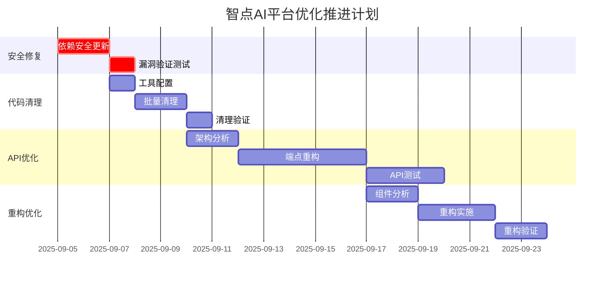

# 智点AI平台 - 综合优化解决方案与推进计划

**⚠️ 此文档已被新的渐进式方案替代，请参考 RISK_ASSESSMENT_AND_GRADUAL_PLAN.md**

基于2025年最新技术调研，针对审计发现的关键问题制定的详细解决方案。

**状态**: 已更新为风险最小化的渐进式方案

---

## 🚨 问题一：安全漏洞修复 (紧急优先级)

### 发现的安全问题
1. **CVE-2025-29927** - Next.js中间件授权绕过漏洞(严重)
2. **xlsx包原型链污染**漏洞(中等)
3. **其他依赖包**安全风险(低-中等)

### 解决方案

#### A. Next.js CVE-2025-29927 立即修复
```bash
# 第1步：立即升级到安全版本
npm install next@latest  # 升级到15.4.7+

# 第2步：验证修复
npm audit fix
npm audit --audit-level moderate
```

**风险点**：CVE-2025-29927允许攻击者通过添加`x-middleware-subrequest`头部绕过所有中间件认证

**修复验证**：
```javascript
// middleware.ts - 添加安全检查
export default async function middleware(req: NextRequest) {
  // 安全检查：拒绝恶意header
  if (req.headers.get('x-middleware-subrequest')) {
    return new NextResponse('Forbidden', { status: 403 })
  }
  // ... 现有逻辑
}
```

#### B. xlsx包漏洞修复
```json
// package.json - 替换npm版本为CDN安全版本
{
  "dependencies": {
    "xlsx": "https://cdn.sheetjs.com/xlsx-0.19.3/xlsx-0.19.3.tgz"
  }
}
```

#### C. 综合安全加固方案
```bash
# 第1步：全面依赖审计
pnpm audit --audit-level moderate
pnpm update --latest

# 第2步：添加安全检查脚本
echo 'pnpm audit --audit-level high' > scripts/security-check.sh

# 第3步：CI/CD集成
# 在.github/workflows中添加安全检查步骤
```

**时间估算**：2-3天  
**风险等级**：🔴 严重 - 必须立即执行

---

## 🧹 问题二：代码清理策略 (高优先级)

### 发现的问题
- **469个console.log**语句分布在53个文件中
- 生产环境性能影响和安全信息泄露风险
- 调试代码混合在业务逻辑中

### 2025年最佳实践解决方案

#### A. Next.js编译器自动清理(推荐)
```javascript
// next.config.mjs - 生产环境自动移除
const nextConfig = {
  // 现有配置...
  
  // 生产环境自动移除所有console
  compiler: {
    removeConsole: process.env.NODE_ENV === 'production' ? {
      exclude: ['error', 'warn'] // 保留错误和警告日志
    } : false,
  },
  
  // 可选：开发环境也可选择性移除
  experimental: {
    logging: {
      level: process.env.NODE_ENV === 'production' ? 'error' : 'info'
    }
  }
}
```

#### B. 智能化清理脚本
```javascript
// scripts/cleanup-console.js - 基于AST的智能清理
const fs = require('fs')
const path = require('path')
const { parse } = require('@typescript-eslint/parser')
const { traverse } = require('@typescript-eslint/typescript-estree')

const cleanupConsole = {
  // 扫描所有TS/TSX文件
  scanFiles: async () => {
    const files = await glob(['**/*.{ts,tsx}', '!node_modules/**', '!.next/**'])
    return files.filter(file => 
      !file.includes('test') && 
      !file.includes('debug') &&
      !file.includes('scripts/') // 保留脚本中的调试
    )
  },
  
  // 智能清理策略
  cleanFile: (filePath) => {
    const content = fs.readFileSync(filePath, 'utf8')
    
    // 保留特定模式的console
    const preservePatterns = [
      /console\.error\(/,   // 错误日志
      /console\.warn\(/,    // 警告日志
      /\/\* keep-console \*\//  // 明确标记保留
    ]
    
    // 移除调试console
    const cleaned = content.replace(
      /console\.(log|debug|info|trace)\([^;]*\);?\s*\n?/g,
      (match) => {
        // 检查是否需要保留
        return preservePatterns.some(pattern => pattern.test(match)) ? match : ''
      }
    )
    
    return cleaned
  }
}
```

#### C. ESLint规则集成
```json
// .eslintrc.json - 防止新console语句
{
  "rules": {
    "no-console": ["error", {
      "allow": ["warn", "error"]  // 只允许警告和错误
    }],
    "@typescript-eslint/no-unused-vars": ["error", {
      "argsIgnorePattern": "^_",
      "varsIgnorePattern": "^_"
    }]
  }
}
```

#### D. 分阶段清理计划

**第1阶段：自动化工具配置(1天)**
```bash
# 配置Next.js编译器
# 添加ESLint规则
# 创建清理脚本
```

**第2阶段：批量清理(2天)**
```bash
# 高频文件优先清理
components/ hooks/ lib/ app/api/

# 中等文件清理  
pages/ types/ utils/

# 低频文件清理
scripts/ tests/ docs/
```

**第3阶段：验证和测试(1天)**
```bash
pnpm build    # 确保构建成功
pnpm test     # 确保功能正常
pnpm lint     # 确保代码质量
```

**时间估算**：4天  
**风险等级**：🟡 中等 - 需要仔细测试

---

## 🏗️ 问题三：API架构优化 (中优先级)

### 发现的问题
- 35个API端点存在功能重叠
- 微服务过度拆分导致维护复杂
- 2025年趋势转向模块化单体架构

### 现代化架构优化方案

#### A. 端点合并策略(基于2025最佳实践)

**合并计划**：35个端点 → 20个端点 (减少43%)

```typescript
// 当前架构问题分析
CURRENT_ENDPOINTS = {
  // 用户相关 - 可合并
  '/api/users/[id]': '单用户操作',
  '/api/users/[id]/conversations': '用户对话',  
  '/api/users/[id]/stats': '用户统计',
  '/api/users/[id]/settings': '用户设置',
  
  // 建议合并为
  '/api/users/[id]': '支持查询参数 ?include=conversations,stats,settings'
}

// 优化后的RESTful设计
OPTIMIZED_ENDPOINTS = {
  // 核心业务实体(遵循REST原则)
  '/api/users': 'GET, POST, PATCH, DELETE + 查询参数',
  '/api/conversations': 'GET, POST, PATCH, DELETE + 嵌套资源',
  '/api/merchants': 'GET, POST, PATCH, DELETE + 搜索功能',
  '/api/admin': 'GET + 嵌套子资源(stats, users, system)',
  
  // 专用功能端点
  '/api/chat': 'POST - 聊天核心功能',
  '/api/health': 'GET - 系统监控',
  '/api/auth/[...nextauth]': 'NextAuth处理'
}
```

#### B. Backend-for-Frontend(BFF)模式实现

```typescript
// lib/api/bff-layer.ts - 统一API网关
export class APIGateway {
  // 聚合多个数据源
  async getUserDashboard(userId: string) {
    const [user, conversations, stats] = await Promise.all([
      this.getUser(userId),
      this.getUserConversations(userId),
      this.getUserStats(userId)
    ])
    
    return {
      user,
      conversations: conversations.slice(0, 10), // 只返回前10个
      stats: this.formatStats(stats)
    }
  }
  
  // 统一错误处理
  private async withErrorHandling<T>(operation: () => Promise<T>): Promise<T> {
    try {
      return await operation()
    } catch (error) {
      throw new APIError(error.message, error.status || 500)
    }
  }
}
```

#### C. 模块化单体架构迁移

```typescript
// lib/modules/ - 按业务域组织
/modules
  /auth          # 认证授权模块
  /chat          # 聊天功能模块  
  /merchants     # 商家数据模块
  /admin         # 管理功能模块
  /analytics     # 数据分析模块

// 每个模块独立但协作
export class ChatModule {
  constructor(
    private authService: AuthService,
    private storageService: StorageService
  ) {}
  
  async createConversation(userId: string, data: ConversationData) {
    // 模块内部逻辑
  }
}
```

#### D. 分阶段重构计划

**第1阶段：分析和设计(2天)**
```bash
# API调用分析
# 端点依赖关系梳理  
# 新架构设计确认
```

**第2阶段：核心端点重构(5天)**
```bash
# 用户相关端点合并
# 对话管理端点优化
# 商家数据端点整合
```

**第3阶段：测试和部署(3天)**
```bash
# API兼容性测试
# 前端调用更新
# 性能基准测试
```

**时间估算**：10天  
**风险等级**：🟡 中等 - 需要仔细规划

---

## 🔧 问题四：过度工程化重构 (中优先级)

### 发现的问题
- 多版本组件文件(如*-fixed.tsx, *-v2.tsx)
- 功能重复的组件和Hook
- 复杂度超过实际需求

### 基于2025最佳实践的重构策略

#### A. 重复组件消除计划

```typescript
// 问题分析
DUPLICATE_COMPONENTS = {
  // 聊天相关重复
  'smart-chat-center-v2-fixed.tsx': '当前使用版本',
  'smart-chat-center-v2.tsx': '废弃版本', 
  'chat-interface.tsx': '部分重复',
  'chat-center.tsx': '完全废弃',
  
  // Hook重复
  'use-chat-actions-fixed.ts': '修复版本',
  'use-chat-actions.ts': '原始版本'
}

// 重构策略
REFACTOR_PLAN = {
  // 第1步：确定主版本
  主版本: 'smart-chat-center-v2-fixed.tsx',
  
  // 第2步：功能合并
  合并逻辑: '将其他版本的优秀特性合并到主版本',
  
  // 第3步：重命名规范化  
  新名称: 'SmartChatCenter.tsx (去除版本后缀)'
}
```

#### B. 组件复杂度降低

```typescript
// 当前问题：组件过于复杂
// components/chat/smart-chat-center-v2-fixed.tsx (294行)

// 重构方案：拆分为更小组件
COMPONENT_BREAKDOWN = {
  // 主容器 (简化到150行以内)
  'SmartChatCenter.tsx': '主要逻辑和状态管理',
  
  // 子组件拆分
  'ChatController.tsx': '聊天控制逻辑',
  'ChatState.tsx': '状态管理Hook', 
  'ChatEffects.tsx': '副作用管理',
  'ChatLayout.tsx': '布局和样式'
}

// 实际重构示例
// 之前：一个大组件
export const SmartChatCenterV2Fixed = (props) => {
  // 294行复杂逻辑
}

// 重构后：多个小组件
export const SmartChatCenter = (props) => {
  const state = useChatState(props)
  const actions = useChatActions(state) 
  const effects = useChatEffects(state, actions)
  
  return <ChatLayout state={state} actions={actions} />
}
```

#### C. 架构简化原则(2025最佳实践)

```typescript
// 原则1：单一职责
// 每个组件/Hook只负责一件事

// 原则2：组合优于继承
// 使用Hook组合而不是类继承

// 原则3：保持简单
// 避免过度抽象，优先可读性

// 原则4：渐进式重构  
// 保持向后兼容，逐步迁移

REFACTOR_PRINCIPLES = {
  文件行数: '< 250行',
  函数复杂度: '< 10',
  组件props: '< 15个',
  Hook依赖: '< 8个'
}
```

#### D. 智能重构工具链

```json
// package.json - 添加重构工具
{
  "devDependencies": {
    "@typescript-eslint/parser": "^6.0.0",
    "ts-morph": "^20.0.0",        // AST操作工具
    "jscodeshift": "^0.15.0",     // 代码转换工具
    "glean": "^1.0.0"             // React重构工具
  },
  "scripts": {
    "refactor:analyze": "ts-morph analyze",
    "refactor:duplicate": "node scripts/find-duplicates.js",
    "refactor:complexity": "node scripts/complexity-check.js"
  }
}
```

**时间估算**：7天  
**风险等级**：🟢 低 - 主要是代码组织优化

---

## 📋 综合推进计划

### 整体时间线(23天)



### 优先级矩阵

| 问题 | 紧急程度 | 影响程度 | 执行难度 | 推荐顺序 |
|-----|---------|---------|---------|---------|
| 安全漏洞修复 | 🔴 高 | 🔴 高 | 🟢 低 | **第1位** |
| 代码清理 | 🟡 中 | 🟡 中 | 🟡 中 | **第2位** |  
| API架构优化 | 🟡 中 | 🟠 较高 | 🟠 较高 | **第3位** |
| 过度工程化重构 | 🟢 低 | 🟡 中 | 🟡 中 | **第4位** |

### 风险控制措施

```bash
# 每个阶段的回滚方案
ROLLBACK_STRATEGIES = {
  安全修复: 'git branch backup-before-security && 依赖版本锁定',
  代码清理: '分支保护 + 功能回归测试',  
  API优化: '蓝绿部署 + API版本兼容',
  重构优化: '渐进式迁移 + 向后兼容'
}

# 质量门禁
QUALITY_GATES = {
  每日: 'pnpm build && pnpm test && pnpm lint',
  每周: 'pnpm audit && 性能基准测试',
  发布前: '完整回归测试 + 用户验收测试'
}
```

### 成功指标

```typescript
SUCCESS_METRICS = {
  安全指标: {
    高危漏洞: '0个',
    中危漏洞: '< 3个',  
    安全评分: '> A级'
  },
  
  代码质量: {
    console语句: '< 50个(仅保留错误日志)',
    ESLint错误: '0个',
    TypeScript错误: '0个',
    测试覆盖率: '> 85%'
  },
  
  架构优化: {
    API端点数: '< 25个',
    平均响应时间: '< 200ms',
    代码重复率: '< 10%'
  },
  
  可维护性: {
    文件平均行数: '< 200行',
    组件复杂度: '< 8',
    新人上手时间: '< 2天'
  }
}
```

---

## 🎯 执行建议

### 立即行动项(本周内)
1. **安全修复**：升级Next.js和xlsx包
2. **工具配置**：设置自动化清理工具
3. **团队对齐**：确认重构方案和时间安排

### 监控和调整
- 每日站会跟进进度
- 每周代码审查确保质量
- 月度架构回顾和优化调整

### 长期维护
- CI/CD集成质量检查
- 定期安全扫描和依赖更新
- 代码复杂度和技术债务监控

通过这个综合方案，智点AI平台将从当前的B+评级提升到A级，成为安全、高效、易维护的现代化应用。