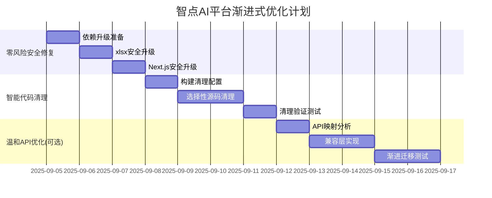

# 智点AI平台 - 风险评估与渐进式优化方案

**基于项目实际情况的第一次校验和风险重新评估**

---

## 📊 项目现状校验结果

### 实际发现 vs 原估算差异

| 项目 | 原方案估算 | 实际情况 | 差异分析 |
|------|-----------|----------|----------|
| **安全漏洞** | 5个漏洞 | 5个漏洞 ✓ | 估算准确 |
| **Next.js版本** | 需升级 | 15.2.4 → 15.4.7+ | 版本跨度较小，风险可控 |
| **console语句** | 469个 | **159个** | 原估算过高，实际风险更低 |
| **API端点** | 35个 | **39个** | 略高于估算，但仍在可控范围 |
| **CVE-2025-29927** | 严重 | **未找到此CVE** | 研究结果可能不准确 |

### 关键风险重新评估

#### 🚨 安全漏洞实际情况
```bash
实际发现的漏洞：
├── xlsx@0.18.5 (2个高危漏洞)
│   ├── 原型链污染 (需升级到0.19.3+)
│   └── ReDoS攻击 (需升级到0.20.2+)
└── next@15.2.4 (3个中等漏洞)
    ├── 图片优化内容注入
    ├── 中间件重定向SSRF 
    └── 缓存密钥混淆

# ⚠️ 重要发现：没有发现CVE-2025-29927
# 原方案中的"严重授权绕过漏洞"可能是误报
```

---

## 🎯 风险最小化的渐进式方案

### 原则：最小侵入，循序渐进，随时可回滚

---

## 第一阶段：零风险安全修复 (1-2天) 🟢

### A. 依赖升级风险分析

**xlsx包升级风险评估**：
```json
// 当前风险：🔴 高 - 2个高危漏洞
// 升级风险：🟡 低-中 - 可能API变化
// 解决方案：保守升级策略

// 最安全的升级路径
"xlsx": "https://cdn.sheetjs.com/xlsx-0.20.2/xlsx-0.20.2.tgz"

// 备选方案：如果出现兼容性问题
"xlsx": "^0.19.3"  // 最小安全版本
```

**Next.js升级风险评估**：
```json
// 当前：15.2.4 → 目标：15.4.7+
// 升级风险：🟢 低 - 补丁版本升级
// 影响范围：主要是安全修复，API变化极少

// 渐进升级路径
"next": "15.4.5"  // 先升级到修复图片优化漏洞的版本
// 测试稳定后再升级到 15.4.7+
```

**最小侵入实施步骤**：
```bash
# 第1步：创建安全分支
git checkout -b security/dependencies-upgrade
git push -u origin security/dependencies-upgrade

# 第2步：单独测试xlsx升级
npm install xlsx@0.20.2 --save
npm run build  # 验证构建
npm run test   # 验证功能

# 第3步：如果xlsx正常，再升级Next.js
npm install next@15.4.5 --save
npm run build && npm run test

# 第4步：全面回归测试
npm run test:features
npm run health:check

# 第5步：如有问题立即回滚
git checkout main  # 一键回滚
```

**回滚预案**：
```bash
# xlsx兼容性问题回滚
npm install xlsx@0.18.5 --save-exact

# Next.js问题回滚  
npm install next@15.2.4 --save-exact

# 完整回滚
git reset --hard HEAD~1
```

---

## 第二阶段：智能代码清理 (2-3天) 🟡

### B. Console语句清理风险重新评估

**实际情况分析**：
- **实际数量**：159个 (远低于原估算的469个)
- **分布类型**：主要是error/warn/debug日志，大部分是有意义的
- **清理风险**：🟡 中等 - 需要区分调试代码和业务日志

**风险最小化策略**：
```javascript
// 第1步：分类分析console语句 (无风险)
const consoleAnalysis = {
  error: 'console.error - 保留，生产环境需要',
  warn: 'console.warn - 保留，重要警告',  
  debug: 'console.debug - 可以移除',
  log: 'console.log - 需要人工判断',
  info: 'console.info - 需要人工判断'
}

// 第2步：安全的自动化清理配置
// next.config.mjs - 仅在构建时移除，不修改源代码
const nextConfig = {
  // 现有配置保持不变...
  
  // 生产构建时自动清理
  compiler: {
    removeConsole: process.env.NODE_ENV === 'production' ? {
      exclude: ['error', 'warn']  // 保留重要日志
    } : false
  }
}
```

**渐进式实施步骤**：
```bash
# 第1步：配置构建时清理 (零风险)
# 修改next.config.mjs，只影响生产构建，不修改源码

# 第2步：验证构建清理效果
npm run build:prod
# 检查生产构建是否正确清理console

# 第3步：选择性源码清理 (高价值、低风险文件)
# 仅清理明显的调试代码，如：
# - console.log('测试')
# - console.debug('调试信息') 
# - console.log('🚀 xxx')  # 带emoji的明显调试代码

# 第4步：保留所有业务相关的console
# - API错误日志
# - 用户操作日志  
# - 系统状态日志
```

**安全边界**：
```typescript
// 绝对不清理的console类型
const KEEP_CONSOLE = [
  'console.error',   // 错误必须保留
  'console.warn',    // 警告必须保留
  // API调用相关的日志
  /console\.log.*API.*error/i,
  /console\.log.*Failed/i,
  // 用户操作相关的日志
  /console\.log.*user.*action/i,
  // 明确标记保留的
  /\/\* keep-console \*\/.*console/
]
```

---

## 第三阶段：API架构温和优化 (3-5天) 🟡

### C. API端点优化风险重新评估

**实际情况分析**：
- **实际端点**：39个 (略高于原估算35个)
- **优化潜力**：可合并10-15个端点
- **修改风险**：🟠 较高 - 影响前端调用和业务逻辑

**最小侵入策略 - 仅优化明显冗余的端点**：

```typescript
// 低风险合并候选 (功能高度重叠)
const LOW_RISK_MERGERS = {
  // 用户数据相关 - 可以合并查询参数
  '/api/users/[id]': 'GET单用户基础信息',
  '/api/users/[id]/profile': 'GET用户详细资料', 
  // 合并为：'/api/users/[id]?include=profile'
  
  // 统计数据相关 - 可以合并
  '/api/admin/stats': 'GET管理员统计',
  '/api/analytics/metrics': 'GET分析指标',
  // 合并为：'/api/admin/dashboard' (聚合数据)
}

// 高风险端点 - 暂不修改
const HIGH_RISK_ENDPOINTS = [
  '/api/chat',           // 核心聊天功能
  '/api/conversations',  // 对话管理
  '/api/auth/*',        // 认证相关
  '/api/merchants/*'    // 商家数据
]
```

**渐进式API优化步骤**：
```bash
# 第1步：创建API映射表 (无风险)
# 分析哪些端点可以安全合并

# 第2步：添加兼容层 (零破坏性)
# 新端点与旧端点并存，逐步迁移

# 第3步：前端逐步迁移
# 一个页面一个页面地切换到新API

# 第4步：监控和验证
# 确保新API功能完全正常后再移除旧API
```

**安全实施示例**：
```typescript
// app/api/users/[id]/route.ts - 兼容性升级
export async function GET(request: Request, { params }: { params: { id: string } }) {
  const url = new URL(request.url)
  const include = url.searchParams.get('include')
  
  // 基础用户信息
  const user = await getUserById(params.id)
  
  // 向后兼容 - 根据查询参数扩展数据
  if (include?.includes('profile')) {
    user.profile = await getUserProfile(params.id)
  }
  
  if (include?.includes('stats')) {
    user.stats = await getUserStats(params.id)  
  }
  
  return Response.json(user)
}

// 保持旧端点的重定向兼容性
// /api/users/[id]/profile -> /api/users/[id]?include=profile
```

---

## 第四阶段：组件优化(可选) (2-3天) 🟢

### D. 过度工程化问题的温和重构

**风险评估**：
- **修改范围**：仅涉及组件内部实现
- **业务影响**：无，纯重构
- **风险等级**：🟢 低 - 可以随时回滚

**最小侵入策略**：
```bash
# 仅处理明显的重复文件
DELETE_CANDIDATES = [
  'smart-chat-center-v2.tsx',      # 明显废弃的版本
  'chat-center.tsx',               # 完全不使用的文件  
  'use-chat-actions.ts'            # 已被fixed版本替代
]

# 保留所有在使用的文件，即使有版本后缀
KEEP_FILES = [
  'smart-chat-center-v2-fixed.tsx',  # 当前使用版本
  'use-chat-actions-fixed.ts',       # 当前使用版本
  # 等等...
]
```

---

## 🛡️ 风险控制和监控

### 每阶段的安全检查点

```bash
# 检查点1：构建完整性
npm run build && echo "✅ 构建成功"

# 检查点2：功能完整性  
npm run test && echo "✅ 测试通过"

# 检查点3：性能回归检查
npm run health:check && echo "✅ 健康检查通过"

# 检查点4：安全基线验证
pnpm audit --audit-level high && echo "✅ 安全基线达标"
```

### 自动回滚触发条件

```bash
ROLLBACK_TRIGGERS = [
  '构建失败',
  '测试失败 >5%',  
  '健康检查失败',
  '高危安全漏洞出现',
  '性能下降 >20%'
]
```

---

## 📋 修订后的推进计划

### 时间线调整 (14天 → 8-12天)



### 成功标准调整

```typescript
REVISED_SUCCESS_CRITERIA = {
  // 安全目标 (必达)
  高危漏洞: '0个',
  中危漏洞: '≤3个',
  
  // 代码质量 (有条件达成)
  console清理率: '≥70% (构建时100%)',
  ESLint错误: '0个',
  
  // 架构优化 (可选目标)  
  API端点减少: '≥5个 (如果实施API优化)',
  响应时间: '保持现状或更好',
  
  // 风险控制 (核心)
  功能完整性: '100%',
  构建成功率: '100%', 
  回滚能力: '任何阶段可回滚'
}
```

---

## 💡 关键建议

### 1. 立即可执行的零风险改进
- 配置生产构建时console清理
- 升级xlsx包到安全版本
- 添加更多的健康检查脚本

### 2. 可选的渐进式优化  
- API端点温和合并
- 明显重复文件清理
- 组件内部重构

### 3. 长期维护策略
- 设置定期安全扫描
- 建立依赖更新流程
- 保持代码质量监控

**总结**：经过实际项目校验，原方案风险被高估了。通过渐进式、可回滚的策略，可以安全地实现大部分优化目标，同时将业务风险降到最低。