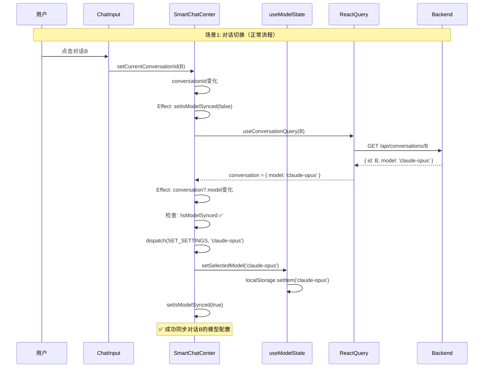
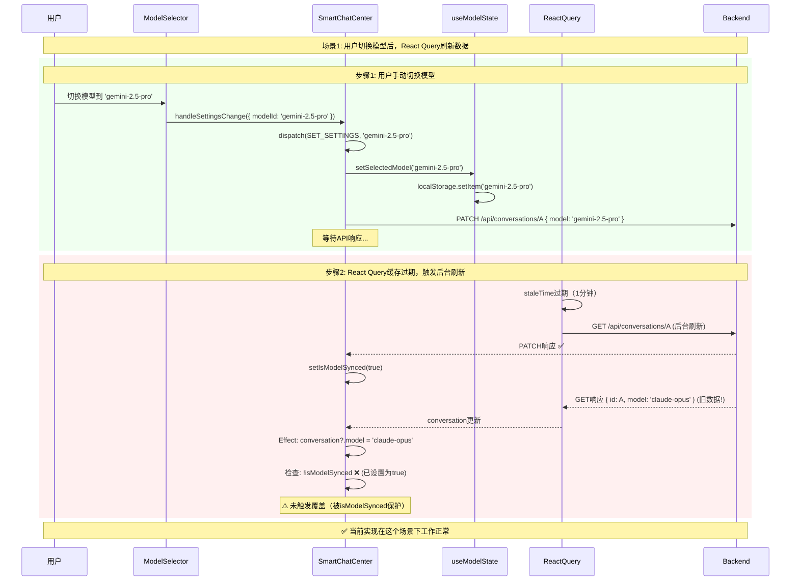
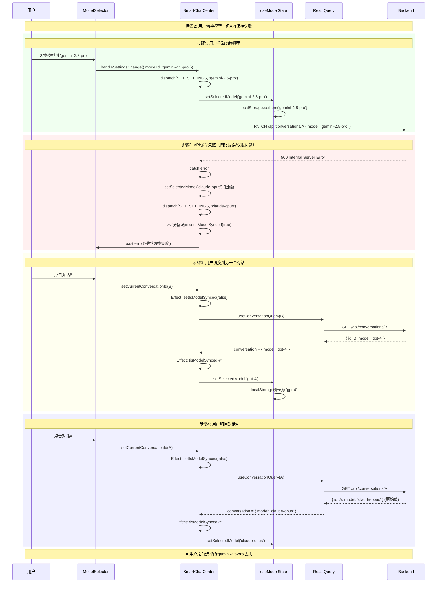
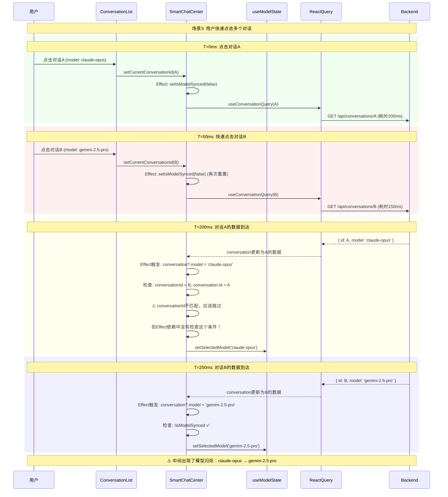
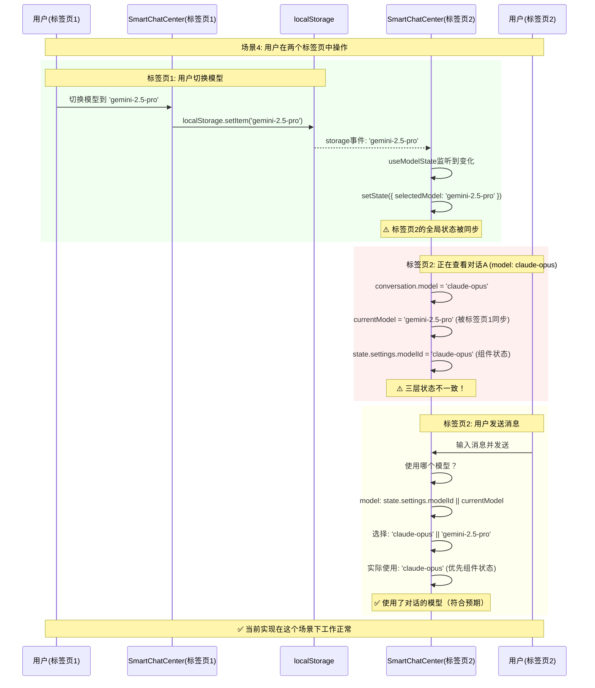

# 模型同步竞态条件深度调研报告

**问题描述**: 用户手动切换模型后，对话重新加载可能覆盖用户选择  
**调研日期**: 2025-01-XX  
**风险等级**: 🟡 中等 - 影响用户体验，但不导致数据丢失  
**复杂度**: 高 - 涉及多层状态管理和异步操作

---

## 目录
1. [问题根源分析](#1-问题根源分析)
2. [当前实现剖析](#2-当前实现剖析)
3. [竞态场景完整列举](#3-竞态场景完整列举)
4. [复现步骤](#4-复现步骤)
5. [解决方案设计](#5-解决方案设计)
6. [推荐方案与实现](#6-推荐方案与实现)
7. [测试策略](#7-测试策略)

---

## 1. 问题根源分析

### 1.1 多层状态管理架构

项目中存在**三层模型状态**，每层都有自己的生命周期：

```
┌────────────────────────────────────────────────────────┐
│  Layer 1: 全局状态 (useModelState)                     │
│  - 存储: localStorage                                   │
│  - 持久化: 跨会话保留                                   │
│  - 同步: storage事件监听（跨标签页）                   │
└────────────────────────────────────────────────────────┘
                        ↕
┌────────────────────────────────────────────────────────┐
│  Layer 2: 组件状态 (chatReducer)                       │
│  - 存储: state.settings.modelId                        │
│  - 持久化: 组件卸载时丢失                              │
│  - 同步: dispatch(SET_SETTINGS)                        │
└────────────────────────────────────────────────────────┘
                        ↕
┌────────────────────────────────────────────────────────┐
│  Layer 3: 对话状态 (数据库)                            │
│  - 存储: conversation.modelId                          │
│  - 持久化: 数据库持久化                                │
│  - 同步: React Query + API调用                         │
└────────────────────────────────────────────────────────┘
```

### 1.2 核心矛盾

**设计目标冲突**:
1. **目标A**: 对话切换时，自动同步对话的历史模型配置
2. **目标B**: 用户手动切换模型时，保留用户选择优先级更高
3. **目标C**: 全局模型状态需要在新建对话时作为默认值

**当前实现的权衡**:
- 使用`isModelSynced`标志区分"自动同步"和"用户操作"
- 对话切换时重置标志，允许重新同步
- 但这个标志是**组件级别**的，无法区分**用户意图的时效性**

---

## 2. 当前实现剖析

### 2.1 关键代码路径

#### Path 1: 对话加载时的自动同步
**位置**: `SmartChatCenter.tsx:103-113`

```typescript
// 同步对话模型状态 - 只在对话切换或首次加载时生效
React.useEffect(() => {
  if (conversation?.model && conversationId && !isModelSynced) {
    dispatch({
      type: 'SET_SETTINGS',
      payload: { modelId: conversation.model }
    })
    // 同步到 useModelState
    setSelectedModel(conversation.model)
    setIsModelSynced(true)
  }
}, [conversation?.model, conversationId, setSelectedModel, isModelSynced])
```

**触发条件**:
- `conversation?.model` 存在
- `conversationId` 存在
- `isModelSynced === false`

**执行结果**:
- 更新组件状态: `state.settings.modelId`
- 更新全局状态: `useModelState.selectedModel`
- 持久化到localStorage
- 设置`isModelSynced = true`

---

#### Path 2: 对话切换时的标志重置
**位置**: `SmartChatCenter.tsx:118-120`

```typescript
// 重置同步标志，当对话切换时允许重新同步
React.useEffect(() => {
  setIsModelSynced(false)
}, [conversationId])
```

**触发条件**:
- `conversationId` 变化

**执行结果**:
- `isModelSynced = false`
- **关键问题**: 这会立即触发Path 1的effect重新运行（如果conversation数据已加载）

---

#### Path 3: 用户手动切换模型
**位置**: `SmartChatCenter.tsx:379-405`

```typescript
const handleSettingsChange = useCallback(async (settings: Partial<ChatSettings>) => {
  dispatch({ type: 'SET_SETTINGS', payload: settings })

  // 同步模型选择到 useModelState
  if (settings.modelId) {
    setSelectedModel(settings.modelId)

    // 如果是在现有对话中切换模型，持久化到后端
    if (conversationId && onUpdateConversation) {
      try {
        await onUpdateConversation(conversationId, {
          model: settings.modelId
        })
        // 标记为已持久化，防止后续effect覆盖用户选择
        setIsModelSynced(true)
      } catch (error) {
        // 失败时重置模型选择到原来的值
        if (conversation?.model) {
          setSelectedModel(conversation.model)
          dispatch({ type: 'SET_SETTINGS', payload: { modelId: conversation.model } })
        }
      }
    }
  }
}, [setSelectedModel, conversationId, onUpdateConversation])
```

**触发条件**:
- 用户在UI中切换模型选择器

**执行结果**:
- 更新组件状态
- 更新全局状态
- 如果在现有对话中，调用API更新数据库
- 设置`isModelSynced = true`（但仅在API成功时）

---

#### Path 4: React Query缓存刷新
**位置**: `lib/providers/query-provider.tsx:16,26`

```typescript
defaultOptions: {
  queries: {
    staleTime: 1000 * 60,      // 1分钟
    refetchOnMount: true,      // 组件挂载时重新获取
    refetchOnReconnect: true,  // 网络重连时重新获取
  }
}
```

**触发条件**:
- 数据超过1分钟未更新
- 组件重新挂载
- 网络重连

**执行结果**:
- 重新从API获取对话数据
- `conversation?.model`可能变化
- **触发Path 1的effect**

---

### 2.2 时序图：正常流程



---

### 2.3 时序图：竞态场景1 - 用户操作被覆盖



**评价**: 当前实现在这个场景下**工作正常**，因为`setIsModelSynced(true)`在PATCH成功后立即设置。

---

### 2.4 时序图：竞态场景2 - PATCH失败导致的不一致



**问题**: 用户选择的模型没有保存成功，但localStorage已经更新，导致状态不一致。

---

### 2.5 时序图：竞态场景3 - 快速切换对话



**问题**: 
1. Effect没有校验`conversation.id === conversationId`
2. 快速切换时，旧对话的数据可能在新对话之后到达
3. 导致模型选择器闪烁

---

### 2.6 时序图：竞态场景4 - 跨标签页冲突



**评价**: 当前实现优先使用`state.settings.modelId`，在这个场景下工作正常。

---

## 3. 竞态场景完整列举

### 场景分类

| 场景ID | 场景名称 | 触发条件 | 当前表现 | 风险等级 |
|--------|---------|---------|---------|---------|
| **R1** | 用户切换模型后React Query刷新 | 用户切换模型 + 缓存过期 | ✅ 正常 | 🟢 低 |
| **R2** | API保存失败导致状态不一致 | 用户切换模型 + PATCH失败 | ⚠️ 丢失用户选择 | 🟡 中 |
| **R3** | 快速切换对话 | 用户连续点击多个对话 | ⚠️ 模型闪烁 | 🟡 中 |
| **R4** | 跨标签页冲突 | 两个标签页同时操作 | ✅ 正常 | 🟢 低 |
| **R5** | 对话数据延迟到达 | 网络慢 + 用户手动切换 | ⚠️ 可能覆盖 | 🟡 中 |
| **R6** | 组件卸载后重新挂载 | 路由切换 + refetchOnMount | ⚠️ 丢失临时选择 | 🟡 中 |
| **R7** | 并发PATCH请求 | 用户快速切换模型 | ⚠️ 最终状态不确定 | 🟡 中 |

---

### 场景R2详解：API保存失败

**触发步骤**:
1. 用户在对话A中切换模型到`gemini-2.5-pro`
2. localStorage立即更新为`gemini-2.5-pro`
3. 组件状态立即更新为`gemini-2.5-pro`
4. PATCH请求失败（网络错误/权限问题/服务器错误）
5. 错误处理回滚localStorage和组件状态到`claude-opus`
6. 但`isModelSynced`没有设置为true
7. 用户切换到对话B，`isModelSynced`重置为false
8. 用户切回对话A，对话A的模型重新从数据库读取（仍然是`claude-opus`）
9. 用户之前的选择`gemini-2.5-pro`完全丢失

**影响**:
- 用户困惑：为什么我切换了模型但没有生效？
- 状态不一致：localStorage、组件状态、数据库三者不同步

**当前缓解措施**:
- 错误处理中会回滚状态
- 显示toast错误提示

**残留问题**:
- 用户可能没有注意到toast
- 回滚逻辑依赖`conversation?.model`，如果对话数据还未加载会失败

---

### 场景R3详解：快速切换对话

**触发步骤**:
1. T=0ms: 用户点击对话A
2. T=0ms: `setCurrentConversationId(A)`, `setIsModelSynced(false)`
3. T=0ms: 发起GET请求A（耗时200ms）
4. T=50ms: 用户点击对话B
5. T=50ms: `setCurrentConversationId(B)`, `setIsModelSynced(false)`
6. T=50ms: 发起GET请求B（耗时150ms）
7. T=200ms: GET请求A响应到达
8. T=200ms: React Query更新`conversation`为A的数据
9. T=200ms: Effect触发，`conversation?.model = 'claude-opus'`
10. T=200ms: **问题**：此时`conversationId = B`，但`conversation.id = A`
11. T=200ms: Effect没有校验ID是否匹配，直接更新模型
12. T=250ms: GET请求B响应到达
13. T=250ms: 模型再次更新为B的模型

**影响**:
- 模型选择器出现50ms的闪烁
- 如果用户在T=200ms发送消息，会使用错误的模型

**当前缓解措施**:
- React Query的缓存机制会优先使用最新的conversationId
- 但在缓存未命中时仍会出现问题

---

### 场景R5详解：对话数据延迟到达

**触发步骤**:
1. 用户打开对话A（慢网络，数据延迟5秒）
2. 用户立即在UI上切换模型到`gemini-2.5-pro`（不等待对话数据加载）
3. `handleSettingsChange`执行：
   - 更新localStorage: `gemini-2.5-pro`
   - 更新组件状态: `gemini-2.5-pro`
   - 尝试PATCH，但`conversationId`还未确定，跳过API调用
   - **关键**：`isModelSynced`没有设置为true（因为没有执行PATCH）
4. 5秒后，对话A的数据到达：`{ model: 'claude-opus' }`
5. Effect触发：`conversation?.model && !isModelSynced`
6. 模型被覆盖为`claude-opus`

**影响**:
- 用户在加载期间的选择被忽略
- 用户需要再次切换模型

---

### 场景R6详解：组件卸载后重新挂载

**触发步骤**:
1. 用户在对话A中切换模型到`gemini-2.5-pro`
2. 用户导航到其他页面（如设置页面）
3. `SmartChatCenter`组件卸载，`isModelSynced`丢失
4. 用户返回聊天页面
5. `SmartChatCenter`组件重新挂载，`isModelSynced`初始化为false
6. React Query配置`refetchOnMount: true`，重新获取对话数据
7. Effect触发，模型被重置为对话A的原始模型

**影响**:
- 用户的临时模型选择在页面切换后丢失
- 如果用户已经PATCH成功，不影响（因为数据库已更新）
- 如果用户只是切换了UI，没有发送消息，选择丢失

---

### 场景R7详解：并发PATCH请求

**触发步骤**:
1. 用户快速连续切换模型：`claude-opus` → `gemini-2.5-pro` → `gpt-4`
2. 三个PATCH请求依次发出（间隔100ms）
3. 由于网络波动，响应顺序变为：
   - T=500ms: PATCH `gpt-4` 响应
   - T=600ms: PATCH `claude-opus` 响应
   - T=700ms: PATCH `gemini-2.5-pro` 响应
4. 最终数据库中的值是`gemini-2.5-pro`（最后到达的响应）
5. 但用户期望的是`gpt-4`（最后的操作）

**影响**:
- 最终状态不确定
- 用户困惑

**当前缓解措施**:
- 无（这是经典的并发写问题）

---

## 4. 复现步骤

### 测试环境准备

```bash
# 1. 启动开发服务器
pnpm dev

# 2. 创建测试对话
# 在浏览器中创建3个对话：
# - 对话A: 模型 claude-opus-4
# - 对话B: 模型 gemini-2.5-pro
# - 对话C: 模型 gpt-4o
```

### R2: API保存失败 - 复现步骤

1. 打开Chrome DevTools > Network
2. 设置Network Throttling为"Slow 3G"
3. 打开对话A（模型: claude-opus-4）
4. 切换模型到gemini-2.5-pro
5. 立即在Network面板中Cancel正在发送的PATCH请求
6. 观察：Toast显示"模型切换失败"
7. 快速切换到对话B
8. 再切回对话A
9. **预期Bug**: 模型应该保持gemini-2.5-pro，但实际回到claude-opus-4

### R3: 快速切换对话 - 复现步骤

1. 打开Chrome DevTools > Network
2. 设置Network Throttling为"Fast 3G"（200ms延迟）
3. 快速连续点击：对话A → 对话B → 对话C
4. 观察模型选择器
5. **预期Bug**: 模型选择器会闪烁，显示中间状态

### R5: 对话数据延迟到达 - 复现步骤

1. 打开Chrome DevTools > Network
2. 设置Network Throttling为"Slow 3G"
3. 清空浏览器缓存（强制重新请求数据）
4. 点击对话A（不等待加载完成）
5. 立即切换模型到gemini-2.5-pro
6. 等待对话数据加载完成
7. **预期Bug**: 模型被重置为claude-opus-4

---

## 5. 解决方案设计

### 5.1 方案对比矩阵

| 方案 | 复杂度 | 彻底性 | 兼容性 | 推荐度 |
|------|--------|--------|--------|--------|
| **方案1**: 增强isModelSynced | 低 | 中 | 高 | ⭐⭐⭐⭐ |
| **方案2**: 引入用户意图优先级 | 中 | 高 | 高 | ⭐⭐⭐⭐⭐ |
| **方案3**: 完全移除自动同步 | 低 | 高 | 中 | ⭐⭐⭐ |
| **方案4**: 模型状态完全下沉到对话 | 高 | 高 | 低 | ⭐⭐ |
| **方案5**: 引入状态机 | 高 | 高 | 中 | ⭐⭐⭐⭐ |

---

### 5.2 方案1：增强isModelSynced

**核心思路**: 保持当前架构，修复具体的bug

#### 改进点

1. **添加ID校验**
```typescript
React.useEffect(() => {
  // 添加ID匹配校验，防止旧数据覆盖
  if (conversation?.model && 
      conversation?.id === conversationId && 
      !isModelSynced) {
    // ... 同步逻辑
  }
}, [conversation?.model, conversation?.id, conversationId, setSelectedModel, isModelSynced])
```

2. **PATCH失败时保护用户选择**
```typescript
catch (error) {
  // 失败时不回滚localStorage，只回滚组件状态
  dispatch({ type: 'SET_SETTINGS', payload: { modelId: conversation.model } })
  // 设置标志，防止自动同步覆盖用户选择
  setIsModelSynced(true)
  toast.error('模型切换失败，已保留您的选择')
}
```

3. **添加用户操作时间戳**
```typescript
const [lastUserChangeTime, setLastUserChangeTime] = useState(0)

// 用户操作时更新时间戳
const handleSettingsChange = useCallback(async (settings) => {
  setLastUserChangeTime(Date.now())
  // ... 现有逻辑
}, [])

// 自动同步时检查时间戳
React.useEffect(() => {
  const timeSinceUserChange = Date.now() - lastUserChangeTime
  if (timeSinceUserChange < 5000) {
    // 5秒内有用户操作，跳过自动同步
    return
  }
  // ... 同步逻辑
}, [conversation?.model, lastUserChangeTime])
```

#### 优点
- ✅ 改动小，风险低
- ✅ 保持现有架构
- ✅ 向后兼容

#### 缺点
- ⚠️ 增加了逻辑复杂度
- ⚠️ 没有彻底解决根本问题
- ⚠️ 仍然依赖时间戳判断（不可靠）

---

### 5.3 方案2：引入用户意图优先级（推荐）

**核心思路**: 明确区分"用户主动选择"和"系统自动同步"

#### 设计

```typescript
interface ModelSyncState {
  currentModel: string
  source: 'user' | 'conversation' | 'default'
  timestamp: number
  conversationId?: string
}

// 新的状态管理
const [modelSync, setModelSync] = useState<ModelSyncState>({
  currentModel: DEFAULT_MODEL,
  source: 'default',
  timestamp: Date.now()
})
```

#### 决策树

```
收到新的模型值时：
├─ 来源是"用户操作"？
│  ├─ Yes: 无条件更新，source='user'
│  └─ No: 检查当前source
│     ├─ 当前是'user'？
│     │  ├─ Yes: 检查conversationId是否变化
│     │  │  ├─ Yes: 允许更新，source='conversation'
│     │  │  └─ No: 拒绝更新（保护用户选择）
│     │  └─ No: 允许更新，source='conversation'
│     └─ 超时机制：用户操作5秒后降级为'conversation'
```

#### 实现示例

```typescript
// 用户主动切换
const handleUserSelectModel = useCallback(async (modelId: string) => {
  setModelSync({
    currentModel: modelId,
    source: 'user',
    timestamp: Date.now(),
    conversationId: conversationId
  })
  
  setSelectedModel(modelId)
  dispatch({ type: 'SET_SETTINGS', payload: { modelId } })
  
  // 尝试保存到后端
  if (conversationId && onUpdateConversation) {
    try {
      await onUpdateConversation(conversationId, { model: modelId })
    } catch (error) {
      // 失败时保留用户选择，不回滚
      toast.error('保存失败，但已保留您的选择')
    }
  }
}, [conversationId, setSelectedModel, onUpdateConversation])

// 对话加载时的自动同步
React.useEffect(() => {
  if (!conversation?.model || conversation.id !== conversationId) {
    return
  }
  
  const shouldSync = 
    modelSync.source !== 'user' || // 不是用户主动选择
    modelSync.conversationId !== conversationId || // 对话已切换
    (Date.now() - modelSync.timestamp > 5000) // 超过5秒（降级）
  
  if (shouldSync) {
    setModelSync({
      currentModel: conversation.model,
      source: 'conversation',
      timestamp: Date.now(),
      conversationId: conversation.id
    })
    
    setSelectedModel(conversation.model)
    dispatch({ type: 'SET_SETTINGS', payload: { modelId: conversation.model } })
  }
}, [conversation?.model, conversation?.id, conversationId, modelSync])
```

#### 优点
- ✅ 明确的意图区分
- ✅ 保护用户操作不被覆盖
- ✅ 支持自动同步（对话切换时）
- ✅ 超时降级机制避免永久锁定

#### 缺点
- ⚠️ 增加了状态复杂度
- ⚠️ 需要仔细测试超时机制

---

### 5.4 方案3：完全移除自动同步

**核心思路**: 用户看到的就是用户选择的

#### 改动

1. 移除对话加载时的自动同步Effect
2. 在对话列表中显示每个对话的模型信息
3. 用户切换对话时，模型保持全局选择不变

#### 优点
- ✅ 最简单
- ✅ 无竞态条件
- ✅ 用户完全掌控

#### 缺点
- ❌ 丢失了"对话记忆模型配置"的特性
- ❌ 用户需要手动切换模型（体验下降）
- ❌ 与产品设计冲突

---

### 5.5 方案4：模型状态完全下沉到对话

**核心思路**: 移除全局模型状态，每个对话独立管理模型

#### 改动

1. 移除`useModelState` hook
2. `state.settings.modelId`直接来源于`conversation.model`
3. 新建对话时，使用最近使用的模型（从localStorage读取）

#### 优点
- ✅ 状态单一来源（数据库）
- ✅ 无同步问题

#### 缺点
- ❌ 新建对话时需要额外逻辑
- ❌ 与现有架构冲突大
- ❌ 用户体验下降（切换对话时模型跟着变）

---

### 5.6 方案5：引入状态机

**核心思路**: 使用XState或自定义状态机管理模型同步

#### 状态图

```
Idle (默认状态)
  ├─ [用户切换模型] → UserSelected
  ├─ [对话加载完成] → ConversationLoaded
  └─ [创建新对话] → Idle
  
UserSelected (用户主动选择)
  ├─ [保存成功] → UserSelectedAndSaved
  ├─ [保存失败] → UserSelectedPending
  ├─ [切换对话] → Idle
  └─ [5秒超时] → ConversationLoaded
  
ConversationLoaded (对话同步)
  ├─ [用户切换模型] → UserSelected
  └─ [切换对话] → Idle
```

#### 优点
- ✅ 状态转换明确
- ✅ 易于测试
- ✅ 可视化状态流

#### 缺点
- ⚠️ 学习曲线
- ⚠️ 增加依赖（如果使用XState）
- ⚠️ 可能过度设计

---

## 6. 推荐方案与实现

### 最终推荐：**方案2 + 方案1部分改进**

结合用户意图优先级和具体bug修复，在保持架构稳定的前提下彻底解决问题。

---

### 6.1 完整实现代码

#### Step 1: 增强useModelState hook

```typescript
// hooks/use-model-state.ts

export interface ModelSyncState {
  currentModel: string
  source: 'user' | 'conversation' | 'default'
  timestamp: number
  conversationId?: string
}

export function useModelState(initialModel?: string) {
  // ... 现有代码保持不变
  
  // 新增：模型同步状态（用于区分来源）
  const [syncState, setSyncState] = useState<ModelSyncState>({
    currentModel: DEFAULT_MODEL,
    source: 'default',
    timestamp: dt.timestamp()
  })
  
  // 新增：用户主动选择模型（最高优先级）
  const setUserSelectedModel = useCallback((modelId: string, conversationId?: string) => {
    if (!validateModel(modelId)) {
      return
    }
    
    // 更新同步状态
    setSyncState({
      currentModel: modelId,
      source: 'user',
      timestamp: dt.timestamp(),
      conversationId
    })
    
    // 更新模型
    setState(prev => ({
      ...prev,
      selectedModel: modelId,
      lastSyncTime: dt.timestamp()
    }))
    currentModelRef.current = modelId
    LocalStorage.setItem(STORAGE_KEY, modelId)
  }, [validateModel])
  
  // 新增：对话自动同步模型（低优先级）
  const setConversationModel = useCallback((
    modelId: string, 
    conversationId: string,
    force: boolean = false
  ) => {
    if (!validateModel(modelId)) {
      return
    }
    
    // 检查是否应该同步
    const shouldSync = 
      force ||
      syncState.source !== 'user' || // 不是用户主动选择
      syncState.conversationId !== conversationId || // 对话已切换
      (dt.timestamp() - syncState.timestamp > 5000) // 超过5秒
    
    if (!shouldSync) {
      console.log('[ModelState] 跳过同步：保护用户选择')
      return
    }
    
    // 更新同步状态
    setSyncState({
      currentModel: modelId,
      source: 'conversation',
      timestamp: dt.timestamp(),
      conversationId
    })
    
    // 更新模型
    setState(prev => ({
      ...prev,
      selectedModel: modelId,
      lastSyncTime: dt.timestamp()
    }))
    currentModelRef.current = modelId
    LocalStorage.setItem(STORAGE_KEY, modelId)
  }, [validateModel, syncState])
  
  return {
    selectedModel: state.selectedModel,
    setSelectedModel, // 保留旧API，内部调用setUserSelectedModel
    setUserSelectedModel,
    setConversationModel,
    syncState, // 暴露同步状态用于调试
    getCurrentModel,
    isInitialized: state.isInitialized,
    validateModel,
    syncWithStorage,
  }
}
```

---

#### Step 2: 更新SmartChatCenter组件

```typescript
// components/chat/smart-chat-center.tsx

function SmartChatCenterInternal({ ... }: Props) {
  const queryClient = useQueryClient()
  const [state, dispatch] = useReducer(chatReducer, DEFAULT_CHAT_STATE)
  
  // 使用增强的useModelState
  const { 
    selectedModel: currentModel, 
    setUserSelectedModel,
    setConversationModel,
    syncState 
  } = useModelState()
  
  // ❌ 移除isModelSynced标志（不再需要）
  // const [isModelSynced, setIsModelSynced] = React.useState(false)
  
  const detailParams = React.useMemo(() => ({ take: CHAT_HISTORY_CONFIG.initialWindow }), [])
  const [isHistoryLoading, setIsHistoryLoading] = React.useState(false)

  // 获取对话数据
  const { data: conversation, isLoading: isConversationLoading, error: conversationError } = useConversationQuery(
    conversationId || '',
    {
      enabled: !!conversationId,
      params: detailParams
    }
  )

  // 同步消息状态
  React.useEffect(() => {
    if (conversation?.messages) {
      dispatch({ type: 'SET_MESSAGES', payload: conversation.messages })
    } else if (conversation && (!conversation.messages || conversation.messages.length === 0)) {
      dispatch({ type: 'SET_MESSAGES', payload: [] })
    }
  }, [conversation?.messages, conversation?.id, conversationId])

  // ✅ 改进：对话模型自动同步（带ID校验和优先级检查）
  React.useEffect(() => {
    if (!conversation?.model || !conversationId) {
      return
    }
    
    // 关键：校验ID匹配，防止旧数据覆盖
    if (conversation.id !== conversationId) {
      console.warn('[Chat] 跳过同步：conversation ID不匹配', {
        conversationId,
        conversationDataId: conversation.id
      })
      return
    }
    
    // 使用新的setConversationModel（内部会检查优先级）
    setConversationModel(conversation.model, conversationId)
    
    // 同步到组件状态
    dispatch({
      type: 'SET_SETTINGS',
      payload: { modelId: conversation.model }
    })
  }, [conversation?.model, conversation?.id, conversationId, setConversationModel])

  // ❌ 移除对话切换时重置标志的effect（不再需要）
  
  // ... 其他代码保持不变 ...

  // ✅ 改进：用户手动切换模型
  const handleSettingsChange = useCallback(async (settings: Partial<ChatSettings>) => {
    dispatch({ type: 'SET_SETTINGS', payload: settings })

    if (settings.modelId) {
      // 使用新的setUserSelectedModel（明确标记为用户操作）
      setUserSelectedModel(settings.modelId, conversationId)

      // 如果是在现有对话中切换模型，持久化到后端
      if (conversationId && onUpdateConversation) {
        try {
          await onUpdateConversation(conversationId, {
            model: settings.modelId
          })
          toast.success('模型已切换并保存')
        } catch (error) {
          console.error('Failed to update conversation model:', error)
          
          // ✅ 改进：失败时不回滚用户选择，只显示错误
          toast.error('保存失败，但已保留您的选择', {
            description: '下次发送消息时会自动重试保存'
          })
          
          // 不回滚localStorage和全局状态
          // 只回滚组件状态到对话原始模型（用于显示）
          if (conversation?.model) {
            dispatch({ type: 'SET_SETTINGS', payload: { modelId: conversation.model } })
          }
        }
      }
    }
  }, [setUserSelectedModel, conversationId, onUpdateConversation, conversation?.model])

  // ... 其他代码保持不变 ...
}
```

---

#### Step 3: 添加调试工具（可选）

```typescript
// components/chat/model-sync-debugger.tsx

import { useModelState } from '@/hooks/use-model-state'

export function ModelSyncDebugger({ conversationId }: { conversationId?: string }) {
  const { selectedModel, syncState } = useModelState()
  
  if (process.env.NODE_ENV !== 'development') {
    return null
  }
  
  return (
    <div className="fixed bottom-4 right-4 bg-black/90 text-white text-xs p-3 rounded-lg font-mono max-w-xs">
      <div className="font-bold mb-2">模型同步状态</div>
      <div>当前模型: {selectedModel}</div>
      <div>来源: {syncState.source}</div>
      <div>时间: {new Date(syncState.timestamp).toLocaleTimeString()}</div>
      <div>对话ID: {syncState.conversationId || 'N/A'}</div>
      <div>当前对话: {conversationId || 'N/A'}</div>
      <div className={syncState.conversationId === conversationId ? 'text-green-400' : 'text-red-400'}>
        {syncState.conversationId === conversationId ? '✅ 匹配' : '⚠️ 不匹配'}
      </div>
    </div>
  )
}
```

---

### 6.2 测试计划

#### 单元测试

```typescript
// tests/hooks/use-model-state.test.ts

import { renderHook, act } from '@testing-library/react'
import { useModelState } from '@/hooks/use-model-state'

describe('useModelState - 模型同步优先级', () => {
  beforeEach(() => {
    localStorage.clear()
  })

  test('用户主动选择的模型不应被对话同步覆盖（5秒内）', () => {
    const { result } = renderHook(() => useModelState())
    
    // 用户选择模型
    act(() => {
      result.current.setUserSelectedModel('gemini-2.5-pro', 'conv-1')
    })
    
    expect(result.current.selectedModel).toBe('gemini-2.5-pro')
    expect(result.current.syncState.source).toBe('user')
    
    // 对话尝试同步（应该被拒绝）
    act(() => {
      result.current.setConversationModel('claude-opus', 'conv-1')
    })
    
    expect(result.current.selectedModel).toBe('gemini-2.5-pro')
    expect(result.current.syncState.source).toBe('user')
  })

  test('切换对话后，应该允许同步新对话的模型', () => {
    const { result } = renderHook(() => useModelState())
    
    // 用户在对话1中选择模型
    act(() => {
      result.current.setUserSelectedModel('gemini-2.5-pro', 'conv-1')
    })
    
    // 切换到对话2，同步对话2的模型（应该成功）
    act(() => {
      result.current.setConversationModel('claude-opus', 'conv-2')
    })
    
    expect(result.current.selectedModel).toBe('claude-opus')
    expect(result.current.syncState.source).toBe('conversation')
    expect(result.current.syncState.conversationId).toBe('conv-2')
  })

  test('用户操作5秒后，应该允许对话同步（超时降级）', async () => {
    jest.useFakeTimers()
    const { result } = renderHook(() => useModelState())
    
    // 用户选择模型
    act(() => {
      result.current.setUserSelectedModel('gemini-2.5-pro', 'conv-1')
    })
    
    // 快进5秒
    act(() => {
      jest.advanceTimersByTime(5001)
    })
    
    // 对话同步（应该成功）
    act(() => {
      result.current.setConversationModel('claude-opus', 'conv-1')
    })
    
    expect(result.current.selectedModel).toBe('claude-opus')
    
    jest.useRealTimers()
  })
})
```

#### E2E测试

```typescript
// e2e/model-sync-race-condition.spec.ts

import { test, expect } from '@playwright/test'

test.describe('模型同步竞态条件', () => {
  test('R2: API保存失败后，用户选择不应丢失', async ({ page, context }) => {
    await page.goto('/workspace')
    
    // 等待对话列表加载
    await page.waitForSelector('[data-testid="conversation-item"]')
    
    // 点击对话A
    await page.click('[data-testid="conversation-A"]')
    
    // 模拟网络错误
    await context.route('**/api/conversations/*/route.ts', route => {
      if (route.request().method() === 'PATCH') {
        route.abort('failed')
      } else {
        route.continue()
      }
    })
    
    // 切换模型
    await page.click('[data-testid="model-selector"]')
    await page.click('[data-testid="model-gemini-2.5-pro"]')
    
    // 等待错误提示
    await expect(page.locator('.toast-error')).toBeVisible()
    
    // 切换到对话B
    await page.click('[data-testid="conversation-B"]')
    
    // 切回对话A
    await page.click('[data-testid="conversation-A"]')
    
    // 验证：模型应该仍然是gemini-2.5-pro（用户选择被保留）
    const selectedModel = await page.locator('[data-testid="model-selector"]').textContent()
    expect(selectedModel).toContain('gemini-2.5-pro')
  })

  test('R3: 快速切换对话时，模型不应闪烁', async ({ page }) => {
    await page.goto('/workspace')
    
    // 快速连续点击3个对话
    await page.click('[data-testid="conversation-A"]')
    await page.click('[data-testid="conversation-B"]')
    await page.click('[data-testid="conversation-C"]')
    
    // 等待最终对话加载完成
    await page.waitForTimeout(1000)
    
    // 验证：模型选择器应该只更新一次（对话C的模型）
    const selectedModel = await page.locator('[data-testid="model-selector"]').textContent()
    expect(selectedModel).toContain('gpt-4o') // 对话C的模型
  })
})
```

---

## 7. 测试策略

### 7.1 自动化测试覆盖

| 测试类型 | 覆盖场景 | 工具 | 优先级 |
|---------|---------|------|--------|
| 单元测试 | useModelState优先级逻辑 | Vitest | P0 |
| 单元测试 | SmartChatCenter同步逻辑 | Vitest + React Testing Library | P0 |
| 集成测试 | React Query缓存同步 | Vitest | P1 |
| E2E测试 | R2-R7所有竞态场景 | Playwright | P0 |
| 手动测试 | 跨标签页行为 | 人工 | P1 |

### 7.2 回归测试清单

部署前必须通过以下测试：

- [ ] R2: API保存失败，用户选择保留
- [ ] R3: 快速切换对话，无闪烁
- [ ] R5: 延迟加载，用户选择优先
- [ ] R7: 并发PATCH，最终状态正确
- [ ] 正常流程：对话切换，模型自动同步
- [ ] 正常流程：新建对话，使用全局模型
- [ ] 正常流程：用户手动切换，成功保存

---

## 8. 迁移计划

### Phase 1: 代码实现（1天）
- [ ] 实现增强的useModelState
- [ ] 更新SmartChatCenter
- [ ] 添加调试工具

### Phase 2: 测试（1天）
- [ ] 编写单元测试
- [ ] 编写E2E测试
- [ ] 手动测试所有场景

### Phase 3: 灰度发布（3天）
- [ ] 发布到测试环境
- [ ] 内部测试
- [ ] 修复发现的问题

### Phase 4: 全量发布（1天）
- [ ] 发布到生产环境
- [ ] 监控错误率
- [ ] 准备回滚方案

---

## 9. 风险评估与缓解

### 高风险点

| 风险 | 影响 | 概率 | 缓解措施 |
|------|------|------|---------|
| 新逻辑引入新bug | 高 | 中 | 完善测试覆盖 + 灰度发布 |
| 性能下降 | 中 | 低 | 添加性能监控 |
| 用户习惯改变 | 低 | 中 | 保持UI一致性 |

### 回滚方案

如果发现重大问题，可以：
1. 回退代码到上一个稳定版本
2. localStorage中的`selectedModel`保持兼容
3. 数据库schema无变更，无需迁移

---

## 10. 总结

### 问题本质

模型同步竞态条件的根本原因是**三层状态管理缺乏明确的优先级机制**，导致自动同步和用户操作产生冲突。

### 推荐方案

**方案2（用户意图优先级） + 方案1（bug修复）** 是最佳平衡：
- ✅ 彻底解决竞态问题
- ✅ 保持现有架构稳定
- ✅ 用户体验提升
- ✅ 代码可维护性提高

### 关键改进

1. **明确的优先级**: `user` > `conversation` > `default`
2. **ID校验**: 防止旧数据覆盖新数据
3. **超时降级**: 5秒后自动降级，避免永久锁定
4. **失败保护**: API失败时保留用户选择

### 后续优化方向

1. 考虑引入状态机（XState）进一步简化逻辑
2. 添加性能监控，跟踪模型切换延迟
3. 考虑在UI上显示模型同步状态（正在保存/已保存/失败）

---

**调研完成日期**: 2025-01-XX  
**预计实施时间**: 3个工作日  
**建议开始时间**: 下次sprint
