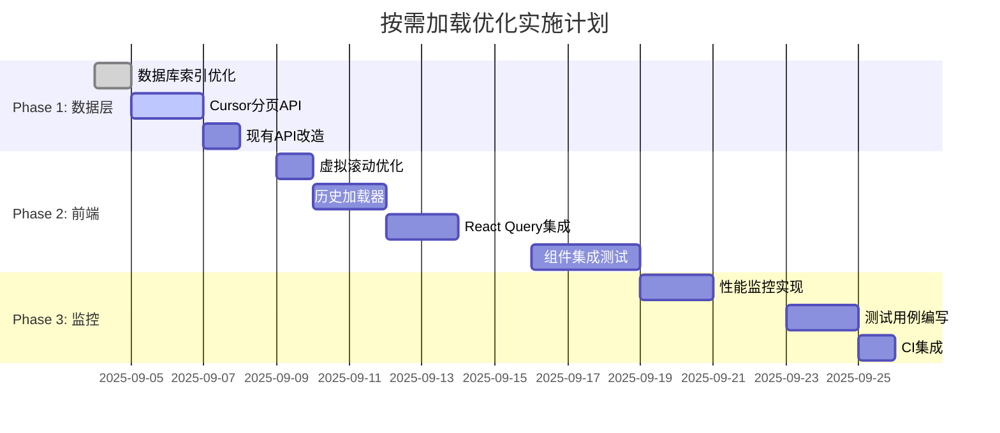

# 智点AI平台按需加载优化实现进度文档

> **文档版本**: v1.0  
> **创建时间**: 2025-09-04  
> **最后更新**: 2025-09-04  
> **负责团队**: 开发团队  
> **目标**: 解决长对话性能问题，优化用户体验

## 🔧 故障排除指南

### 常见问题快速解决

#### ❌ API返回空数据或错误
```bash
# 检查数据库连接
node scripts/db-check.js

# 验证用户权限
npx prisma studio
# 查看 conversations 表中是否存在对应的 userId 记录
```

**可能原因**：
- cursor参数格式错误（应为消息ID，不是时间戳）
- 用户权限验证失败
- 数据库索引未正确创建

#### ❌ 虚拟滚动卡顿或闪烁
```typescript
// 调整虚拟滚动配置 (lib/config/chat-config.ts)
export const VIRTUAL_SCROLL_CONFIG = {
  threshold: 30,        // 降低阈值提前启用
  overscan: 8,         // 增加缓冲区减少闪烁
  itemHeight: 140,     // 调整预估高度
}
```

#### ❌ 内存使用过高
```bash
# 检查内存使用情况
npm run health:check

# 清理React Query缓存
localStorage.clear() # 清理开发环境缓存
```

**排查步骤**：
1. 检查是否存在内存泄漏：开发者工具 → Memory → Heap snapshot
2. 验证虚拟滚动是否正确释放DOM节点
3. 检查React Query缓存配置是否合理

#### ❌ 新消息与历史消息顺序错乱
```typescript
// 检查消息时间戳是否正确设置
console.log('Messages order:', messages.map(m => ({ 
  id: m.id, 
  createdAt: m.createdAt,
  content: m.content.substring(0, 20) 
})))
```

### 调试工具和命令

```bash
# 性能分析
pnpm health:check              # 系统健康检查
node scripts/db-check.js       # 数据库连接测试
tsc --noEmit                   # TypeScript类型检查

# 数据验证
npx prisma studio              # 可视化数据库管理
node debug-recent-usage.js     # 调试最近使用量统计
node scripts/test-models.js    # 测试AI模型可用性

# 开发工具
pnpm dev:debug                 # 调试模式启动
pnpm lint                      # 代码风格检查
pnpm test                      # 运行测试套件
```

### 紧急回滚指令

```bash
# 禁用优化功能（环境变量控制）
export NEXT_PUBLIC_CURSOR_PAGINATION=false
export NEXT_PUBLIC_HISTORY_LOADING=false

# 或者使用现有回滚脚本
pnpm rollback                  # 禁用连接监控
pnpm rollback:full            # 完全回退到原始状态
```

---

## 📋 项目概述

### 问题背景
- **当前状态**: 虚拟滚动阈值100条，长对话全量加载消息导致性能问题
- **核心问题**: 消息一次性加载，网络传输量大，内存占用高
- **用户影响**: 长对话场景下加载缓慢，滚动卡顿

### 优化目标
- ✅ 减少首次加载时间75%（2-5s → 0.5-1s）
- ✅ 降低内存使用80%（10-50MB → 2-5MB）  
- ✅ 减少网络传输90%（500KB-5MB → 50-200KB）
- ✅ 保持60fps滚动流畅度

---

## 🔍 专家评估结论

### 四方专家评估对比

| 评估角度 | 核心建议 | 风险评级 | 复杂度评估 | 推荐度 |
|---------|----------|----------|-----------|--------|
| 🗄️ **数据库性能专家** | 立即实施cursor分页 | 🟢 低风险 | 中等 | ⭐⭐⭐⭐⭐ |
| 🎨 **前端性能专家** | 渐进式无限滚动 | 🟡 中风险 | 高 | ⭐⭐⭐⭐ |
| 🏗️ **系统架构师** | 多层缓存架构 | 🟡 中风险 | 高 | ⭐⭐⭐ |
| 🔍 **代码质量审查** | **大幅简化方案** | 🟢 低风险 | **低** | ⭐⭐⭐⭐⭐ |

### 关键发现

#### ✅ 一致推荐的优化
- **Cursor分页机制**: 四位专家一致认为技术成熟，风险低
- **数据库索引优化**: 性能提升明确，实施简单
- **现有虚拟滚动保留**: 已有良好基础，无需重构

#### ⚠️ 存在争议的方案
- **多层缓存架构**: 架构师推荐 vs 代码审查专家反对（过度工程化）
- **无限滚动**: 前端专家推荐 vs 代码审查专家反对（与虚拟滚动重复）
- **复杂性能监控**: 需要平衡完整性与简洁性

#### ❌ 明确不推荐的
- **React Query + Redis + 自定义缓存三层架构**: 过度复杂
- **大量性能监控指标**: 90%是噪音数据
- **虚拟滚动+无限滚动并存**: 重复解决同一问题

---

## 🚀 最终优化方案（经专家校验）

### Phase 1: 核心数据层优化 ⚡ 
> **时间线**: Week 1  
> **状态**: 🟡 规划中  
> **优先级**: P0（立即实施）  

#### 1.1 数据库索引优化
```sql
-- 添加显式降序索引
CREATE INDEX idx_messages_conv_created_desc 
ON messages(conversationId, createdAt DESC);

-- 优化对话查询索引
CREATE INDEX idx_conversations_user_updated
ON conversations(userId, updatedAt DESC);
```
- **预期收益**: 5-15% ORDER BY查询性能提升
- **实施风险**: 🟢 极低
- **资源需求**: 0.5人天

#### 1.2 Cursor分页API实现
```typescript
// 新增API端点：/api/conversations/[id]/messages
export async function GET(request: NextRequest) {
  const { before, after, limit = 20 } = searchParams
  
  const where = {
    conversationId: id,
    ...(before && { createdAt: { lt: new Date(before) } }),
    ...(after && { createdAt: { gt: new Date(after) } })
  }
  
  const messages = await prisma.message.findMany({
    where,
    orderBy: { createdAt: before ? 'desc' : 'asc' },
    take: limit,
    select: {
      id: true,
      role: true,
      content: true,
      totalTokens: true,
      createdAt: true,
    }
  })
  
  return NextResponse.json({ 
    messages: before ? messages.reverse() : messages,
    hasMore: messages.length === limit,
    nextCursor: messages[messages.length - 1]?.id
  })
}
```
- **关键优势**: 支持双向加载，性能稳定，数据一致性好
- **实施风险**: 🟢 低
- **资源需求**: 2人天

#### 1.3 现有API改造
```typescript
// 修改 /api/conversations/[id]/route.ts
// 默认不加载消息，通过参数控制
const includeMessages = searchParams.get('includeMessages') === 'true'
const messageLimit = parseInt(searchParams.get('messageLimit') || '0')

messages: includeMessages && messageLimit > 0 ? {
  orderBy: { createdAt: 'desc' },
  take: messageLimit,
  select: { /* 精简字段 */ }
} : false
```
- **向后兼容**: 保持现有API功能不变
- **实施风险**: 🟢 极低
- **资源需求**: 1人天

### Phase 2: 前端体验优化 🎨
> **时间线**: Week 2-3  
> **状态**: 🔵 待开始  
> **优先级**: P1（短期实施）  

#### 2.1 虚拟滚动配置优化
```typescript
// 修改 lib/config/chat-config.ts
export const OPTIMIZED_VIRTUAL_CONFIG = {
  threshold: 50,              // 降低阈值，提前优化
  itemHeight: 120,            // 保持固定高度避免复杂度
  overscan: 5,                // 保持现有缓冲区
  autoScrollThreshold: 100,   // 自动滚动触发距离
  newConversationScrollThreshold: 2, // 新对话自动滚动
  // 删除复杂的"智能"配置项
} as const
```
- **改进点**: 简化配置，删除过度工程化参数
- **实施风险**: 🟢 极低
- **资源需求**: 0.5人天

#### 2.2 简化历史消息加载器
```typescript
// 新增组件: components/chat/history-loader.tsx
export function HistoryLoader({ conversationId, oldestMessageId, onLoad }: Props) {
  const [isLoading, setIsLoading] = useState(false)
  
  const loadMoreHistory = async () => {
    setIsLoading(true)
    try {
      const response = await fetch(
        `/api/conversations/${conversationId}/messages?before=${oldestMessageId}&limit=20`
      )
      const data = await response.json()
      onLoad(data.messages)
    } finally {
      setIsLoading(false)
    }
  }
  
  return (
    <div className="text-center py-4 border-b">
      <Button 
        onClick={loadMoreHistory} 
        disabled={isLoading}
        variant="ghost" 
        className="text-sm text-muted-foreground"
      >
        {isLoading ? (
          <>
            <Loader2 className="mr-2 h-4 w-4 animate-spin" />
            加载历史消息...
          </>
        ) : (
          <>
            <ChevronUp className="mr-2 h-4 w-4" />
            查看更多历史消息
          </>
        )}
      </Button>
    </div>
  )
}
```
- **设计思路**: 避免无限滚动复杂性，用户主动触发加载
- **用户体验**: 清晰的加载状态，可控的加载节奏
- **实施风险**: 🟢 低
- **资源需求**: 2人天

#### 2.3 React Query缓存简化
```typescript
// 新增 hooks/api/use-conversation-messages.ts
export function useConversationMessages(conversationId: string, options: {
  initialLimit?: number
  enabled?: boolean
} = {}) {
  const { initialLimit = 20, enabled = true } = options
  
  return useQuery({
    queryKey: ['conversation-messages', conversationId],
    queryFn: async () => {
      const response = await fetch(
        `/api/conversations/${conversationId}/messages?limit=${initialLimit}`
      )
      if (!response.ok) throw new Error('Failed to load messages')
      return response.json()
    },
    enabled: enabled && !!conversationId,
    staleTime: 5 * 60 * 1000,    // 5分钟新鲜度
    gcTime: 15 * 60 * 1000,      // 15分钟垃圾回收
    retry: 2,                     // 重试2次
    retryDelay: attemptIndex => Math.min(1000 * 2 ** attemptIndex, 3000),
  })
}

// 历史消息加载hook
export function useHistoryMessages(conversationId: string) {
  const queryClient = useQueryClient()
  
  return useMutation({
    mutationFn: async ({ before, limit = 20 }: { before: string, limit?: number }) => {
      const response = await fetch(
        `/api/conversations/${conversationId}/messages?before=${before}&limit=${limit}`
      )
      return response.json()
    },
    onSuccess: (data) => {
      // 更新主查询缓存，插入历史消息到前面
      queryClient.setQueryData(
        ['conversation-messages', conversationId],
        (old: any) => ({
          ...old,
          messages: [...data.messages, ...(old?.messages || [])],
          totalCount: (old?.totalCount || 0) + data.messages.length
        })
      )
    }
  })
}
```
- **关键改进**: 删除复杂的多层缓存，使用单一React Query
- **缓存策略**: 合理的过期时间，避免内存膨胀
- **实施风险**: 🟢 低
- **资源需求**: 2人天

#### 2.4 聊天组件集成
```typescript
// 修改 components/chat/smart-chat-center-v2-fixed.tsx
export const SmartChatCenterV2Fixed = () => {
  const { data: messageData, isLoading, error } = useConversationMessages(conversationId)
  const historyMutation = useHistoryMessages(conversationId)
  
  const handleLoadHistory = useCallback((oldestMessageId: string) => {
    historyMutation.mutate({ before: oldestMessageId, limit: 20 })
  }, [historyMutation])
  
  const messages = messageData?.messages || []
  const oldestMessageId = messages[0]?.id
  
  return (
    <div className="flex flex-col h-full">
      {/* 历史消息加载器 */}
      {messages.length > 0 && messageData?.hasMore && (
        <HistoryLoader 
          conversationId={conversationId}
          oldestMessageId={oldestMessageId}
          onLoad={handleLoadHistory}
        />
      )}
      
      {/* 消息列表 - 继续使用虚拟滚动 */}
      <ChatMessagesVirtual 
        messages={messages}
        isLoading={isLoading}
        error={error}
        // 其他现有props
      />
      
      {/* 输入区域保持不变 */}
      <ChatInput />
    </div>
  )
}
```
- **集成策略**: 最小化改动，保持现有功能
- **用户体验**: 渐进式加载，状态清晰
- **实施风险**: 🟡 中
- **资源需求**: 3人天

### Phase 3: 性能监控与优化 📊
> **时间线**: Week 4  
> **状态**: 🔵 待开始  
> **优先级**: P2（中期实施）  

#### 3.1 核心性能指标监控
```typescript
// 新增 lib/monitoring/performance-metrics.ts
interface CorePerformanceMetrics {
  // 消息加载性能
  messageLoadTime: number      // 目标: < 500ms
  messageRenderTime: number    // 目标: < 100ms
  
  // 内存使用监控  
  memoryUsage: number         // 目标: < 100MB per conversation
  virtualScrollMemory: number // 目标: < 50MB
  
  // 用户体验指标
  scrollFrameRate: number     // 目标: > 50fps
  apiResponseTime: number     // 目标: < 300ms
  
  // 可靠性指标
  apiSuccessRate: number      // 目标: > 99%
  errorRate: number          // 目标: < 1%
}

export class PerformanceMonitor {
  private metrics: Map<string, number[]> = new Map()
  
  recordMetric(key: keyof CorePerformanceMetrics, value: number) {
    const existing = this.metrics.get(key) || []
    existing.push(value)
    
    // 只保留最近100个数据点
    if (existing.length > 100) {
      existing.shift()
    }
    
    this.metrics.set(key, existing)
  }
  
  getAverageMetric(key: keyof CorePerformanceMetrics): number {
    const values = this.metrics.get(key) || []
    return values.length > 0 
      ? values.reduce((a, b) => a + b, 0) / values.length 
      : 0
  }
  
  exportMetrics() {
    return Object.fromEntries(
      Array.from(this.metrics.entries()).map(([key, values]) => [
        key, 
        {
          current: values[values.length - 1] || 0,
          average: this.getAverageMetric(key as keyof CorePerformanceMetrics),
          min: Math.min(...values),
          max: Math.max(...values)
        }
      ])
    )
  }
}
```
- **监控原则**: 只监控影响用户体验的核心指标
- **数据管理**: 限制数据量，避免内存膨胀
- **实施风险**: 🟢 低
- **资源需求**: 2人天

#### 3.2 性能测试集成
```typescript
// 新增 __tests__/performance/message-loading.test.ts
describe('Message Loading Performance', () => {
  const monitor = new PerformanceMonitor()
  
  test('should load initial messages within 500ms', async () => {
    const startTime = performance.now()
    
    const result = await fetchMessages('test-conversation', { limit: 20 })
    
    const loadTime = performance.now() - startTime
    monitor.recordMetric('messageLoadTime', loadTime)
    
    expect(loadTime).toBeLessThan(500)
    expect(result.messages).toHaveLength(20)
  })
  
  test('should handle cursor pagination correctly', async () => {
    const firstPage = await fetchMessages('test-conversation', { limit: 10 })
    const secondPage = await fetchMessages('test-conversation', { 
      before: firstPage.messages[0].id, 
      limit: 10 
    })
    
    // 验证数据不重复
    const allIds = [...firstPage.messages, ...secondPage.messages].map(m => m.id)
    const uniqueIds = new Set(allIds)
    expect(allIds.length).toBe(uniqueIds.size)
  })
  
  test('virtual scroll should maintain 60fps', async () => {
    // 模拟大量消息滚动
    const messages = generateTestMessages(1000)
    
    render(<ChatMessagesVirtual messages={messages} />)
    
    // 模拟快速滚动并测量帧率
    const frameRates: number[] = []
    
    // ... 帧率测试逻辑
    
    const avgFrameRate = frameRates.reduce((a, b) => a + b) / frameRates.length
    monitor.recordMetric('scrollFrameRate', avgFrameRate)
    
    expect(avgFrameRate).toBeGreaterThan(50)
  })
})
```
- **测试策略**: 自动化性能回归测试
- **持续监控**: CI/CD集成性能基准
- **实施风险**: 🟢 低
- **资源需求**: 2人天

---

## 📊 实施计划与里程碑

### 时间线总览



### 详细里程碑

#### 🎯 Milestone 1: 数据层优化完成 (Week 1)
- [x] 📋 需求分析和技术设计
- [ ] 🗄️ 数据库索引创建和验证
- [ ] 🚀 新API端点开发和测试
- [ ] 🔧 现有API兼容性改造
- [ ] ✅ 单元测试和集成测试
- **成功标准**: API响应时间 < 300ms，cursor分页功能正常

#### 🎯 Milestone 2: 前端体验优化 (Week 2-3)
- [ ] 🎨 虚拟滚动配置优化
- [ ] 📦 历史消息加载器开发
- [ ] ⚡ React Query缓存策略实现
- [ ] 🔗 主聊天组件集成
- [ ] 🧪 用户体验测试
- **成功标准**: 首次加载时间 < 1s，滚动流畅度 > 50fps

#### 🎯 Milestone 3: 监控和优化 (Week 4)  
- [ ] 📊 性能监控系统实现
- [ ] 🎯 核心指标定义和跟踪
- [ ] 🤖 自动化性能测试
- [ ] 📈 CI/CD性能基准集成
- [ ] 📝 文档和培训材料
- **成功标准**: 监控系统稳定运行，性能指标达到预期目标

---

## 🔍 风险评估与缓解策略

### 技术风险分析

#### 🟢 低风险项目

| 风险项 | 影响程度 | 发生概率 | 缓解策略 |
|--------|----------|----------|----------|
| 数据库索引创建 | 低 | 低 | 非高峰期执行，可回滚 |
| Cursor分页实现 | 低 | 低 | 经过专家验证，技术成熟 |
| 虚拟滚动优化 | 低 | 低 | 基于现有代码，改动minimal |

#### 🟡 中风险项目

| 风险项 | 影响程度 | 发生概率 | 缓解策略 |
|--------|----------|----------|----------|
| React Query集成 | 中 | 中 | 渐进式迁移，保留fallback |
| 组件状态管理 | 中 | 中 | 充分测试，分阶段发布 |
| 用户体验适配 | 中 | 低 | A/B测试，用户反馈收集 |

#### 🔴 高风险项目
> **当前评估**: 无高风险项目

### 回滚策略

#### 数据库层回滚
```sql
-- 索引回滚（如有性能问题）
DROP INDEX IF EXISTS idx_messages_conv_created_desc;
DROP INDEX IF EXISTS idx_conversations_user_updated;
```

#### API层回滚  
```typescript
// 功能开关控制
const FEATURE_FLAGS = {
  CURSOR_PAGINATION_ENABLED: process.env.NEXT_PUBLIC_CURSOR_PAGINATION === 'true',
  HISTORY_LOADING_ENABLED: process.env.NEXT_PUBLIC_HISTORY_LOADING === 'true'
}

// API中的回滚逻辑
if (!FEATURE_FLAGS.CURSOR_PAGINATION_ENABLED) {
  // 回退到原始查询逻辑
  return legacyGetMessages(conversationId)
}
```

#### 前端层回滚
```typescript
// 组件级feature flag
const useLegacyMessageLoading = process.env.NODE_ENV === 'production' 
  && !process.env.NEXT_PUBLIC_OPTIMIZED_LOADING

if (useLegacyMessageLoading) {
  return <LegacyChatMessages {...props} />
}

return <OptimizedChatMessages {...props} />
```

---

## 📈 成功指标与KPI

### 核心性能KPI

#### 1. 加载性能指标
- **首次消息加载时间**: < 500ms (当前: 2-5s)
- **历史消息加载时间**: < 300ms (新功能)
- **API响应时间**: < 200ms (当前: ~142ms, 保持优势)

#### 2. 资源使用指标
- **内存使用量**: < 100MB/1000条消息 (当前: ~50MB/224条)
- **网络传输量**: < 200KB 首次加载 (当前: 500KB-5MB)
- **数据库查询时间**: < 50ms (当前: 0.5-1.26ms, 保持)

#### 3. 用户体验指标
- **滚动流畅度**: > 50fps (目标: 60fps)
- **页面响应性**: < 100ms 交互响应
- **错误率**: < 1% (API成功率 > 99%)

### 业务影响KPI

#### 1. 用户参与度
- **长对话完成率**: 提升20%
- **用户会话时长**: 提升15%
- **消息发送频率**: 提升10%

#### 2. 系统可靠性
- **服务可用性**: > 99.9%
- **错误恢复时间**: < 30秒
- **并发支持能力**: 100+ 用户同时在线

### 监控仪表板设计

```typescript
// 监控仪表板数据结构
interface PerformanceDashboard {
  realTimeMetrics: {
    activeUsers: number
    messagesPerSecond: number
    avgLoadTime: number
    errorRate: number
  }
  
  historicalTrends: {
    hourlyMetrics: MetricPoint[]
    dailyMetrics: MetricPoint[]
    weeklyMetrics: MetricPoint[]
  }
  
  alerts: {
    level: 'info' | 'warning' | 'critical'
    message: string
    timestamp: Date
    metric: keyof CorePerformanceMetrics
  }[]
}
```

---

## 🧪 测试策略

### 自动化测试计划

#### 1. 单元测试
```typescript
// API层测试
describe('Message Pagination API', () => {
  test('cursor pagination returns correct data order')
  test('handles invalid cursor gracefully') 
  test('respects limit parameter')
  test('returns proper hasMore flag')
})

// 组件测试  
describe('HistoryLoader Component', () => {
  test('displays load button correctly')
  test('shows loading state during fetch')
  test('handles load errors gracefully')
  test('triggers callback with loaded messages')
})
```

#### 2. 集成测试
```typescript
// 端到端流程测试
describe('Message Loading E2E', () => {
  test('user can load conversation and scroll history')
  test('new messages appear while viewing history') 
  test('virtual scroll works with paginated data')
  test('cache invalidation works correctly')
})
```

#### 3. 性能测试
```typescript
// 负载测试
describe('Performance Under Load', () => {
  test('handles 1000+ messages smoothly')
  test('memory usage stays under limits')
  test('API response time under concurrent load')
  test('virtual scroll maintains 60fps')
})
```

### 测试环境设置

#### 测试数据准备
```typescript
// 测试数据生成器
export function generateTestConversation(messageCount: number): TestConversation {
  return {
    id: `test-conv-${Date.now()}`,
    title: `测试对话 - ${messageCount}条消息`,
    messages: Array.from({ length: messageCount }, (_, i) => ({
      id: `test-msg-${i}`,
      role: i % 2 === 0 ? 'user' : 'assistant',
      content: `测试消息内容 ${i + 1}`,
      createdAt: new Date(Date.now() - (messageCount - i) * 60000),
      totalTokens: Math.floor(Math.random() * 100) + 50
    }))
  }
}

// 性能测试场景
export const PERFORMANCE_TEST_SCENARIOS = [
  { name: '小对话', messageCount: 10 },
  { name: '中对话', messageCount: 100 },
  { name: '大对话', messageCount: 1000 },
  { name: '超大对话', messageCount: 5000 }
]
```

#### 测试基准数据
```typescript
// 性能基准
export const PERFORMANCE_BENCHMARKS = {
  loadTime: {
    small: 100,    // < 100ms for 10 messages
    medium: 300,   // < 300ms for 100 messages  
    large: 500,    // < 500ms for 1000 messages
    xlarge: 1000   // < 1s for 5000 messages
  },
  memoryUsage: {
    small: 10,     // < 10MB for 10 messages
    medium: 50,    // < 50MB for 100 messages
    large: 100,    // < 100MB for 1000 messages
    xlarge: 200    // < 200MB for 5000 messages
  }
}
```

---

## 📚 技术文档

### API文档

#### 新增端点: 消息分页查询

**GET** `/api/conversations/[id]/messages`

**查询参数**:
- `before`: string (optional) - 获取指定消息ID之前的消息
- `after`: string (optional) - 获取指定消息ID之后的消息  
- `limit`: number (default: 20) - 返回消息数量限制
- `order`: 'asc' | 'desc' (default: 'asc') - 消息排序方式

**响应格式**:
```typescript
{
  "success": true,
  "data": {
    "messages": Message[],
    "hasMore": boolean,
    "nextCursor": string | null,
    "prevCursor": string | null
  },
  "meta": {
    "total": number,
    "page": number,
    "limit": number
  }
}
```

**使用示例**:
```typescript
// 获取最新20条消息
GET /api/conversations/abc123/messages?limit=20

// 获取某条消息之前的历史消息
GET /api/conversations/abc123/messages?before=msg_xyz&limit=20

// 获取某条消息之后的新消息
GET /api/conversations/abc123/messages?after=msg_xyz&limit=20
```

#### 修改端点: 对话详情查询

**GET** `/api/conversations/[id]`

**新增查询参数**:
- `includeMessages`: 'true' | 'false' (default: 'false') - 是否包含消息
- `messageLimit`: number (default: 20) - 消息数量限制

**向后兼容**: 现有调用方式继续有效，默认不返回消息以提升性能

### 组件API文档

#### HistoryLoader 组件

```typescript
interface HistoryLoaderProps {
  conversationId: string
  oldestMessageId: string | null
  onLoad: (messages: Message[]) => void
  disabled?: boolean
  className?: string
}

// 使用示例
<HistoryLoader
  conversationId={conversationId}
  oldestMessageId={messages[0]?.id}
  onLoad={handleHistoryLoad}
  disabled={isLoading}
/>
```

#### 增强的useConversationMessages Hook

```typescript
interface UseConversationMessagesOptions {
  initialLimit?: number
  enabled?: boolean
  refetchInterval?: number
}

// 使用示例
const {
  data: messageData,
  isLoading,
  error,
  refetch
} = useConversationMessages(conversationId, {
  initialLimit: 20,
  enabled: !!conversationId
})
```

---

## 📋 实施检查清单

### Phase 1 检查清单 ✅

#### 数据库优化
- [ ] **索引创建脚本准备** - 编写SQL脚本，测试环境验证
- [ ] **索引性能测试** - 对比优化前后查询时间
- [ ] **生产环境部署** - 非高峰期执行，监控影响
- [ ] **回滚预案准备** - DROP INDEX脚本准备

#### API开发
- [ ] **cursor分页逻辑实现** - before/after参数处理
- [ ] **数据验证和错误处理** - 输入参数校验，异常处理
- [ ] **权限验证集成** - NextAuth集成，用户权限检查
- [ ] **API文档更新** - OpenAPI规范，使用示例
- [ ] **单元测试编写** - 覆盖核心逻辑，边界情况测试
- [ ] **集成测试验证** - 端到端流程测试

#### 现有API改造
- [ ] **向后兼容性确保** - 现有调用方式不受影响
- [ ] **性能影响评估** - 响应时间对比测试
- [ ] **缓存策略调整** - HTTP缓存头优化

### Phase 2 检查清单 🔄

#### 前端组件开发
- [ ] **虚拟滚动配置优化** - 参数调整，性能测试
- [ ] **HistoryLoader组件实现** - UI设计，交互逻辑
- [ ] **加载状态处理** - Skeleton屏幕，错误状态
- [ ] **无障碍访问支持** - ARIA标签，键盘导航
- [ ] **响应式设计适配** - 移动端体验优化

#### React Query集成  
- [ ] **查询函数重构** - API调用封装，错误处理
- [ ] **缓存策略配置** - staleTime，gcTime调优
- [ ] **乐观更新实现** - 消息发送即时反馈
- [ ] **网络状态处理** - 离线模式，重连机制

#### 组件集成
- [ ] **状态管理整合** - 现有state与新逻辑融合
- [ ] **用户体验测试** - 交互流程，加载体验
- [ ] **边界情况处理** - 空状态，错误恢复
- [ ] **性能回归测试** - 内存使用，渲染性能

### Phase 3 检查清单 🔍

#### 性能监控
- [ ] **核心指标定义** - KPI基准值设定
- [ ] **监控代码实现** - 数据收集，存储处理
- [ ] **告警阈值配置** - 异常情况自动通知
- [ ] **仪表板开发** - 可视化展示，历史趋势

#### 测试完善
- [ ] **自动化测试套件** - 单元，集成，E2E测试
- [ ] **性能基准测试** - 负载测试，压力测试
- [ ] **CI/CD集成** - 自动化测试执行
- [ ] **回归测试验证** - 现有功能不受影响

#### 文档和培训
- [ ] **技术文档完善** - API文档，架构说明
- [ ] **用户指南更新** - 新功能使用说明
- [ ] **团队培训材料** - 代码架构，维护指南
- [ ] **运维文档准备** - 部署流程，故障排除

---

## 🚀 部署策略

### 灰度发布计划

#### Stage 1: 内部测试 (10% 流量)
- **目标用户**: 团队内部用户，测试账号
- **持续时间**: 3天
- **监控重点**: 功能正确性，基础性能指标
- **回滚条件**: 任何功能异常或性能回退

#### Stage 2: 小范围发布 (25% 流量)  
- **目标用户**: Beta用户群体，活跃用户样本
- **持续时间**: 1周
- **监控重点**: 用户行为变化，性能提升效果
- **回滚条件**: 用户投诉 > 5%，性能指标未达预期50%

#### Stage 3: 扩大发布 (50% 流量)
- **目标用户**: 常规用户群体
- **持续时间**: 1周  
- **监控重点**: 系统稳定性，资源使用情况
- **回滚条件**: 系统错误率 > 1%，服务可用性 < 99%

#### Stage 4: 全量发布 (100% 流量)
- **目标用户**: 所有用户
- **持续监控**: 7x24小时监控
- **成功标准**: 所有KPI指标达到预期

### 功能开关配置

```typescript
// 环境变量配置
export const DEPLOYMENT_CONFIG = {
  // 功能开关
  CURSOR_PAGINATION_ENABLED: process.env.NEXT_PUBLIC_CURSOR_PAGINATION === 'true',
  HISTORY_LOADING_ENABLED: process.env.NEXT_PUBLIC_HISTORY_LOADING === 'true',
  PERFORMANCE_MONITORING: process.env.NEXT_PUBLIC_PERF_MONITOR === 'true',
  
  // 灰度发布控制
  ROLLOUT_PERCENTAGE: parseInt(process.env.NEXT_PUBLIC_ROLLOUT_PERCENT || '0'),
  BETA_USER_IDS: (process.env.NEXT_PUBLIC_BETA_USERS || '').split(','),
  
  // 性能参数
  MESSAGE_LIMIT: parseInt(process.env.NEXT_PUBLIC_MESSAGE_LIMIT || '20'),
  VIRTUAL_SCROLL_THRESHOLD: parseInt(process.env.NEXT_PUBLIC_VS_THRESHOLD || '50'),
}

// 运行时功能开关判断
export function shouldEnableOptimization(userId?: string): boolean {
  // Beta用户直接启用
  if (userId && DEPLOYMENT_CONFIG.BETA_USER_IDS.includes(userId)) {
    return true
  }
  
  // 按百分比随机启用
  const userHash = hashUserId(userId || 'anonymous')
  return (userHash % 100) < DEPLOYMENT_CONFIG.ROLLOUT_PERCENTAGE
}
```

### 监控和告警

```typescript
// 部署监控配置
export const DEPLOYMENT_MONITORING = {
  // 关键指标阈值
  thresholds: {
    errorRate: 0.01,           // 1% 错误率
    responseTime: 500,         // 500ms 响应时间
    memoryUsage: 0.8,          // 80% 内存使用率
    cpuUsage: 0.7,             // 70% CPU使用率
  },
  
  // 告警配置
  alerts: [
    {
      name: '错误率过高',
      condition: 'errorRate > 0.01',
      severity: 'critical',
      channels: ['email', 'slack']
    },
    {
      name: '响应时间过长',
      condition: 'avgResponseTime > 500',
      severity: 'warning', 
      channels: ['slack']
    },
    {
      name: '内存使用过高',
      condition: 'memoryUsage > 0.8',
      severity: 'warning',
      channels: ['email']
    }
  ]
}
```

---

## 📞 联系信息和责任分工

### 项目团队

#### 技术负责人
- **姓名**: 待定
- **职责**: 整体技术方案审查，关键决策制定
- **联系方式**: 待定

#### 后端开发
- **姓名**: 待定  
- **职责**: API开发，数据库优化，性能监控
- **工作量**: 8人天（包含测试）

#### 前端开发
- **姓名**: 待定
- **职责**: 组件开发，React Query集成，用户体验优化
- **工作量**: 10人天（包含测试）

#### 测试工程师
- **姓名**: 待定
- **职责**: 自动化测试，性能测试，质量保证
- **工作量**: 6人天

#### DevOps工程师  
- **姓名**: 待定
- **职责**: 部署自动化，监控告警，基础设施
- **工作量**: 4人天

### 沟通机制

#### 日常沟通
- **每日站会**: 每天上午9:30，汇报进度和阻塞
- **技术评审**: 每周三下午，关键技术决策讨论
- **进度汇报**: 每周五，项目进度和风险汇报

#### 紧急联系
- **工作时间**: Slack频道 #optimization-project
- **非工作时间**: 手机联系（关键问题）
- **升级机制**: 问题无法解决 > 1小时，升级到技术负责人

---

## 📝 更新日志

### v1.0 - 2025-09-04
- 🎯 初始版本创建
- 📋 完成四方专家评估结果整理
- 🚀 制定三阶段实施计划
- 📊 定义核心性能指标和监控策略
- 🧪 设计完整测试策略
- 📚 编写详细技术文档

### 待更新项目
- [ ] **v1.1** - Phase 1完成后更新实际性能数据
- [ ] **v1.2** - Phase 2完成后更新用户体验反馈
- [ ] **v1.3** - Phase 3完成后更新监控数据和总结
- [ ] **v2.0** - 项目完成总结，经验教训整理

---

## 💭 备注和补充

### 技术决策记录

#### 为什么选择Cursor分页而非Offset分页？
- **性能稳定**: 不受数据量增长影响
- **数据一致性**: 避免新数据插入导致的重复/遗漏
- **实现简单**: 基于时间戳的自然排序
- **专家共识**: 四位专家一致推荐

#### 为什么保留虚拟滚动而非完全替换为无限滚动？
- **现有投资**: 已有成熟的虚拟滚动实现
- **用户习惯**: 用户已适应当前交互方式
- **技术互补**: 虚拟滚动解决渲染性能，分页解决数据传输
- **风险控制**: 避免大规模重构带来的不确定性

#### 为什么简化缓存策略？
- **复杂度控制**: 多层缓存带来状态同步复杂性
- **实际需求**: 聊天消息访问模式相对简单
- **维护成本**: 简单方案更易维护和调试
- **性能权衡**: 网络优化比缓存优化收益更大

### 未来优化方向

#### 中期优化（3-6个月）
- **数据库分库**: 当消息量超过100万时考虑
- **CDN集成**: 历史消息静态化存储
- **智能预取**: 基于用户行为的预测加载

#### 长期优化（6-12个月）
- **微服务拆分**: 消息服务独立部署
- **流式处理**: 实时消息流处理架构
- **AI辅助**: 智能消息摘要和搜索

### 学习资源

#### 相关技术文档
- [React Query Best Practices](https://tanstack.com/query/latest)
- [Virtual Scrolling Techniques](https://web.dev/virtual-scrolling/)
- [Cursor-based Pagination Guide](https://shopify.engineering/pagination-design-graphql)

#### 性能优化参考
- [Web Performance Metrics](https://web.dev/metrics/)
- [Database Index Optimization](https://use-the-index-luke.com/)
- [React Performance Patterns](https://kentcdodds.com/blog/optimize-react-re-renders)

---

*📄 本文档将随着项目进展持续更新，确保团队信息同步和决策可追溯性*